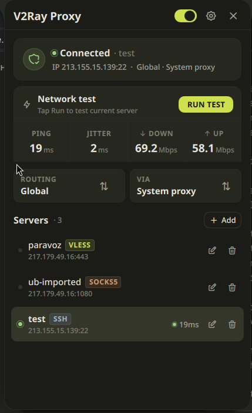

# Noctalia VPN Plugin

VPN / proxy manager for [Noctalia Shell](https://noctalia.dev). One repository
ships two pieces:

- `backend/` — a Python DBus service that drives `sing-box` and `ssh`.
- `plugin/` — the Noctalia Shell QML front-end that talks to that backend.

## What it is

A self-contained VPN control panel that lives in your Noctalia bar:

- Browse and switch between SSH / VLESS / VMess / Shadowsocks / SOCKS5 servers.
- Toggle the system SOCKS5 proxy or a TUN device.
- Route blocked sites via country presets (RU / CN / IR) or your own custom rules.
- See live latency, jitter, throughput, and a one-shot tunnel speed test.
- Optional `nftables` kill switch.
- Import `vless://` / `vmess://` / `ss://` subscription links.

## Screenshots



## Requirements

System:

- Python 3.12+
- [`sing-box`](https://sing-box.sagernet.org) 1.8+ on `$PATH`
- `openssh` and `sshpass` (only if you use SSH servers)
- A DBus session bus (always present on a normal desktop)
- `nft` (only if you want the kill switch)

Python (installed via the `.venv` below):

- `dbus-next` ≥ 0.2.3
- `pydantic` ≥ 2.0
- `aiofiles` ≥ 23.0
- `aiohttp` ≥ 3.9
- `aiohttp-socks` (for the speed test to measure through the tunnel)

## TUN/VPN mode prerequisites

TUN (VPN) mode requires additional privileges for sing-box.

**Option A — One-time setup (recommended):**
Grant CAP_NET_ADMIN to sing-box permanently:
```bash
sudo setcap cap_net_admin+ep /usr/bin/sing-box
```
After this, no password prompts when using TUN mode.

**Option B — Polkit (automatic password prompt):**
The plugin will automatically request privileges via Polkit dialog when TUN mode is activated.

Install the included Polkit rules to avoid repeated password prompts for DNS/routing operations:
```bash
sudo install -m 0644 polkit/10-noctalia-vpn-tun.rules /etc/polkit-1/rules.d/
sudo install -m 0644 polkit/org.noctalia.vpn.policy /usr/share/polkit-1/actions/
```

**Note:** System Proxy mode works without any additional privileges.

## Installation

### Install backend

```bash
git clone https://github.com/UmedjonBA/noctalia-vpn-plugin
cd noctalia-vpn-plugin
python3 -m venv .venv
.venv/bin/pip install -e .
```

### Install plugin

```bash
cp -r plugin ~/.config/noctalia/plugins/noctalia-vpn
```

### Start backend

```bash
cp noctalia-vpn-backend.service ~/.config/systemd/user/
systemctl --user daemon-reload
systemctl --user enable --now noctalia-vpn-backend.service
```

Or manually, for development:

```bash
.venv/bin/python3 -m backend.app
```

The bridge (`plugin/dbus-bridge.py`) will also auto-spawn the backend when the
plugin loads if the DBus name isn't already owned — the systemd unit just gets
it up before the bar so the first paint already shows live status.

### TUN/VPN mode setup

See [TUN/VPN mode prerequisites](#tunvpn-mode-prerequisites) above for the
capability and Polkit setup. TL;DR: either `setcap` once, or install the two
files in `polkit/`.

## Usage

1. Add the Noctalia VPN widget to your bar.
2. Open the panel and click **Add server** — paste a share URL or fill the form.
3. Click the server to activate it.
4. Pick a mode chip:
   - **Rules** — only blocked sites + active presets go through the tunnel.
   - **Global** — everything goes through the tunnel.
5. Pick a proxy mode chip:
   - **System** — sets the system SOCKS5 proxy.
   - **TUN** — creates a TUN device (needs polkit/root).
6. Settings → Routing lets you toggle country presets and add custom rules.
7. Settings → General toggles the bar widget's ping / traffic readouts.

## How it works

```
        ┌─────────────────────────────────────────────────┐
        │   Noctalia Shell plugin (QML)                   │
        │   plugin/Main.qml, BarWidget.qml, Panel.qml     │
        └────────────────┬────────────────────────────────┘
                         │ stdin/stdout JSON
                ┌────────▼─────────┐
                │  dbus-bridge.py  │  (child process of the plugin)
                └────────┬─────────┘
                         │ DBus  (org.noctalia.VpnPlugin)
        ┌────────────────▼────────────────────────────────┐
        │   Python backend (this repo, backend/)          │
        │   - server CRUD, settings, routing rules         │
        │   - sing-box / ssh process supervisor            │
        │   - health monitor, traffic stats, kill switch   │
        └────────────────┬────────────────────────────────┘
                         │ spawn / signal
            ┌────────────▼────────────┐
            │  sing-box   │   ssh     │
            │  (mixed in) │  (-D)     │
            └────────────┬────────────┘
                         │
                      Internet
```

Three sing-box instances run in parallel when the proxy is up:

- **Transport** (`11080`) talks to the remote VPN endpoint.
- **Rules mux** (`11081`) classifies traffic per routing rules and either
  forwards through the transport or sends it direct.
- **Global mux** (`11082`) bypasses the rules engine and forwards everything
  through the transport.

Only one of the mux ports is "exposed" to the system at a time — the choice
follows the mode chip in the panel.

## DBus API

- **Service:** `org.noctalia.VpnPlugin`
- **Object path:** `/org/noctalia/VpnPlugin`
- **Interface:** `org.noctalia.VpnPlugin`

Methods:

| Method | Signature | What it does |
|---|---|---|
| `StartProxy(server_id, mode, proxy_mode)` | `sss → b` | Activate a server in the given routing/proxy mode |
| `StopProxy()` | `→ b` | Tear everything down |
| `GetStatus()` | `→ a{sv}` | Current status snapshot |
| `GetServers()` | `→ aa{sv}` | List saved servers |
| `AddServer(server)` | `a{sv} → s` | Create a server, returns id |
| `UpdateServer(server)` | `a{sv} → b` | Replace by id |
| `RemoveServer(id)` | `s → b` | Delete by id |
| `SwitchServer(id)` | `s → b` | Reconnect with a different server |
| `SetMode(mode)` | `s → b` | `"rules"` or `"global"` |
| `SetProxyMode(mode)` | `s → b` | `"system"` or `"tun"` |
| `PingServer(id)` | `s → i` | TCP ping, returns ms or -1 |
| `RunSpeedTest()` | `→ a{sv}` | Measures down/up Mbps through the tunnel |
| `GetHealth()` | `→ a{sv}` | Latest health snapshot |
| `GetRoutingRules()` | `→ aa{sv}` | List custom routing rules |
| `AddRoutingRule(rule)` | `a{sv} → s` | Add a force-proxy / direct / block rule |
| `RemoveRoutingRule(id)` | `s → b` | Delete by id |
| `GetPresets()` | `→ aa{sv}` | List country presets with `enabled` flag |
| `TogglePreset(key, enabled)` | `sb → b` | Enable/disable a preset (RU/CN/IR) |
| `GetSubscriptions()` | `→ aa{sv}` | List subscription URLs |
| `AddSubscription(url, name)` | `ss → b` | Import + fetch a subscription |
| `RemoveSubscription(url)` | `s → b` | Delete by URL |
| `UpdateSubscription(url)` | `s → i` | Re-fetch, returns server count |
| `GetTrafficStats()` | `→ a{sv}` | Bytes sent/recv, uptime |
| `GetSettings()` | `→ a{sv}` | All persisted settings |
| `UpdateSettings(patch)` | `a{sv} → a{sv}` | Patch UI toggles |
| `SetKillSwitch(enabled)` | `b → b` | Apply/remove the nft kill switch |
| `GetKillSwitchStatus()` | `→ a{sv}` | Is the kill switch armed? |
| `CheckDnsLeak()` | `→ a{sv}` | Heuristic DNS-leak report |
| `GetLogs()` | `→ as` | Last ~100 backend log lines |

Signals: `StatusChanged`, `ServerListChanged`, `LogMessage`, `TrafficUpdate`.

## Ports used

| Port | Role |
|---|---|
| `11080` | Transport — SSH tunnel or sing-box outbound to the remote endpoint |
| `11081` | Rules mux — sing-box with custom rules and country presets |
| `11082` | Global mux — sing-box, everything → tunnel |
| `11089` | sing-box Clash API (internal hot-reload) |

Persisted state: `~/.config/noctalia-vpn/` (`servers.json`, `rules.json`,
`settings.json`, `subscriptions.json`). Generated sing-box configs:
`~/.config/sing-box/noctalia-vpn-*.json`.

## License

MIT
